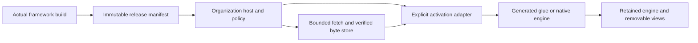

# Architecture and runtime boundaries

OWLS separates five responsibilities: the release contract, preparation policy, byte transport/storage, framework activation, and view lifetime. An organization injects its policy and adapters while sharing the coordinator. There is no singleton spanning every domain or native process.

## Contract

`owls-interfaces` contains the JSON Schema and TypeSpec peer definitions plus TypeScript, Rust and Dart shapes. JSON Schema is the runtime validation authority; the TypeSpec model describes the same shape without claiming every JSON constraint is encoded as a TypeSpec decorator. No implementation is hidden in the contract package. Dart includes serialization helpers and immutable owned values.

Each release has a schemaVersion, appId, immutable release ID, runtime, entrypoint asset ID, assets, and optional extensions. Each asset names its exact canonical HTTPS URL, decoded byte length, SHA-256, kind, and preparation eligibility. The hosts also reject duplicate URLs/IDs, unknown entrypoints, forbidden origins and mismatched runtime/entrypoint kinds. Unknown public fields fail validation; tenant additions belong under extensions.

`owls-runtime::inspect_build` derives sizes/hashes from real build files. It refuses symlinks and guessed entrypoints. Feed its JSON through the public validator and publish it with that exact build. Never guess Flutter filenames or combine bootstrap, engine and application outputs from different releases.

## Preparation and activation

Preparation fetches approved assets within byte and concurrency limits. It never imports JavaScript, invokes a bootstrap, starts WASM, hydrates an island, or mounts a Flutter view. Optional early compilation is explicit for raw WASM. Failed speculative fetching does not poison a later demand fetch.

Preparation is a shared, reference-counted lease in the browser and Dart hosts. `prefetch` resolves a preparation outcome (`warmed`, `failed`, `cancelled` or `skipped`) so callers can measure speculation without treating it as startup. Releasing one lease does not cancel another. Page intent helpers use dwell and exit-grace windows and release unclaimed work on page lifecycle changes.

Demand activation uses one stable adapter object per immutable release and retained host. Successful activation is shared. It claims an in-flight preparation job but joins it only for a bounded handoff (`activationJoinMs`, 50 ms by default); after that, normal demand loading proceeds. TypeScript and Dart remember failed activation too: an adapter may already have changed the document or initialized a runtime. A deadline rejects the caller and signals cancellation; it cannot forcibly undo a non-cooperative callback. Application cleanup or document replacement must precede a deliberate restart. `deactivate` invokes optional adapter cleanup and releases the owner before a deliberate restart.

Custom transports and stores must honor cancellation, bound their own allocations and complete their operations. The built-in fetch transports enforce streaming bounds. A native Rust blocking read observes cancellation between reads and is also bounded by its HTTP timeout.

## Runtime matrix

| Environment | Shipped behavior | Required application ownership |
|---|---|---|
| Browser or Web Worker, raw WASM | Fetch, verify, optionally compile, instantiate with explicit imports | Imports, worker messaging and release lifecycle |
| Browser, wasm-bindgen | Exact generated glue receives verified module bytes | Build-owned glue import and application start function |
| Leptos browser client | Pinned hydration hook through the bindgen adapter | SSR markup, matching build and island selection |
| Dioxus browser client | Caller-supplied launch hook | Router, generated split assets and renderer lifecycle |
| Flutter web / embedded Flutter | Generated custom bootstrap, official loader lifecycle, one engine with multiple views | Build config, renderer asset URLs and document ownership |
| Rust server or native desktop | Verified bytes, persistent file cache, fuel/memory-limited Wasmi raw module execution | Explicit host imports; GUI remains native, no WebView required |
| Dart/Flutter mobile or desktop | Shared host, HTTP/file stores, injected native adapter | Chosen WASM engine/FFI binding and platform packaging |
| Flutter WebView host | Fixed registered-release bridge, request IDs and completion replies | Navigation policy, JavaScript setup, platform WebView and permissions |
| TypeScript server / SSR | DOM-free Link header helpers and portable coordination | Framework rendering and asset serving |

Wasmi is not a Flutter WasmGC host and does not execute a browser's wasm-bindgen DOM glue. A browser executable and a native library need different adapters, even if built from related Rust source. The Dart package intentionally does not pretend a universal native WASM engine exists.

## Storage scope

Memory retains bytes only for its host lifetime. CacheStorage is origin/namespace scoped, optional and evictable. A service worker controls only its eligible clients/scope; this package does not register one automatically. HTTP caching depends on request compatibility, partitioning, credentials and response headers. A marketing-site prefetch is a best-effort hint, especially before navigation to another origin.

A retained same-document host can preserve a compiled module or engine. Full navigation normally destroys it. Native file caches are separate from WebView HTTP caches. A server cache does not populate the user's browser. File stores bound entries; the application owns total disk quota and eviction. Use private application cache directories.

## Integrity and trust

Hash validation protects assets read through the coordinator. A subsequent dynamic import has a separate trust path: the host must pin generated glue and its transitive imports using immutable deployment URLs, CSP, and supported import-map integrity. Flutter bootstrap loading uses script integrity, but framework subresources still require a trusted, internally consistent build and delivery configuration.

Default HTTP transports disallow redirects and public-asset credentials, require a content type appropriate to the manifest kind, and then verify the exact bytes. Origin allowlists are exact, canonical origins, never suffix matches. Private authenticated bundles need an explicit transport policy and must not enter shared public caches. Extension hooks do not weaken those defaults.
