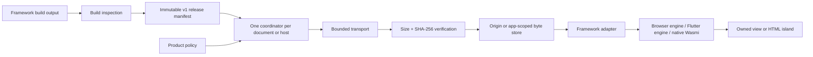

# Shared loader architecture

OWLS is a shared loading protocol and host lifecycle, not a promise that Rust, Flutter and browser runtimes can execute the same binary in the same way. The reusable part is the decision and byte path: validate one immutable release, apply one policy, prepare verified bytes without starting an application, and let a framework-specific adapter own activation.



## The coordinator

Create one `Coordinator` for a browser document or worker, and one `WasmHost` for a native Dart host or an individual native Rust release. Components on the same page share that object. They must not each create an independent warmup map: doing so loses deduplication, budget accounting and ownership information.

The TypeScript coordinator owns these responsibilities:

1. `register(input)` validates and detaches a release. The key is `appId@release`; registering the same key with different immutable content is rejected.
2. `prepare(key, signal?)` acquires a reference-counted `PreparationLease`. All leases for a key share one fetch job. Releasing one lease never cancels another; the job is cancelled only while unclaimed and without leases.
3. `prefetch(key, signal?)` is the convenience fetch-only API. It resolves a `PreparationOutcome` with `warmed`, `failed`, `cancelled` or `skipped`; speculative failure is observable but is not an activation failure.
4. `activate(key, adapter)` claims any existing preparation job, gives it only the bounded `activationJoinMs` handoff (50 ms in the browser default), and then calls the adapter. It demand-loads missing or invalid bytes through the same verified store.
5. `deactivate(key)` invokes the adapter’s optional cleanup and releases the coordinator’s activation owner. A new activation is deliberate after cleanup; an activation that already failed remains terminal until the owner is released.
6. `cancelPreparation(key)` and `cancelAllPreparation()` stop unclaimed speculative work during route changes, `pagehide` and product-level policy changes.

The Dart `WasmHost` exposes the same preparation distinction through `prepare`, `prefetch`, `activate` and `deactivate`. `WasmDeactivator<T>` is an optional second interface for adapters that retain engine or view resources. The native Rust `Host` is deliberately narrower: it provides verified `bytes` and fetch-only `prefetch`, while `NativeRuntime` owns bounded raw-WASM execution. A blocking native host has no browser hover lifecycle to coordinate.

The coordinator does not compile or instantiate merely because a link was hovered. `RawWasmAdapter.compile` is an explicit application choice, and generated JavaScript glue, Flutter bootstraps, renderers, workers and imports remain activation-owned. This keeps “prepared” a safe, cacheable state and keeps application startup a normal demand path.

## Two state machines

Preparation and activation are related by a short handoff, not by one promise that controls both lifetimes.

| State | Meaning | Allowed transition |
|---|---|---|
| `registered` | The detached manifest passed schema, origin and entrypoint checks. | `prepare`, `prefetch` or `activate` |
| `preparing` | One shared job is fetching selected assets under the policy. | `warmed`, `failed`, `cancelled`, or `activate` claims it |
| `warmed` | Selected bytes are in the verified store. No code has executed. | `activate` or future eviction |
| `failed` / `cancelled` / `skipped` | Preparation did not provide all selected bytes. | A later `activate` demand-loads normally |
| `activating` | One stable adapter owns startup. | `active` or terminal activation failure |
| `active` | The adapter returned an application/engine instance. | Shared activation or `deactivate` |
| `activation-failed` | Startup may have changed a document or runtime before failing. | Cleanup and a deliberate new host/owner |
| `deactivated` | The adapter cleanup completed and ownership was removed. | A deliberate new activation |

`activate` waits for an in-flight speculative job only up to the join budget. If that budget expires, the coordinator cancels the speculative job and starts the adapter’s ordinary demand path. This prevents a 30-second preparation timeout from becoming a 30-second click latency. A non-cooperative transport or adapter can continue work in the background, so integrations must honor cancellation and must not expose side effects outside their owner.

## Adapters and runtime boundaries

### Rust HTML-first applications

The pilot’s Rust application should render a useful server-side HTML route first. A Leptos island or another small browser client can be enhanced after an explicit activation gesture; HTML remains the fallback if JavaScript, WASM, CSP or the network is unavailable. The web adapter receives exact generated bindgen glue and a pinned hydrate/start hook. It does not call `__wbindgen_start` directly, and it does not treat a MASH HTML/HTMX response as browser WASM merely because the server is written in Rust.

The native Rust package serves a different boundary. `NativeRuntime` accepts only `raw-wasm`, configures no ambient WASI, filesystem, network or process imports, and keeps Wasmi fuel, memory, instance, table and memory limits enabled. It is useful for a native worker or server-side computation, not for executing browser `wasm-bindgen` glue or Flutter WasmGC output.

### Flutter web applications

The Flutter adapter owns the generated build’s `flutter_js` and `flutter_build_config`, calls the supported Flutter loader lifecycle, and starts one engine with the application’s configured view model. `mountFlutterView` returns an idempotent removal callback. The document owns that engine; multiple views may share one Flutter build, but unrelated Flutter builds need separate documents or explicit isolation.

Preparation may fetch renderer and application files listed in a real Flutter build manifest, but it must not execute a default bootstrap or create a Flutter engine. Activation is where the trusted bootstrap is evaluated and views are mounted. A Dart `WasmHost` can warm a private native file cache, but those bytes do not magically populate a WebView’s browser cache.

### What is and is not shared

| Shared across hosts | Owned by the integrating application |
|---|---|
| Release identity, schema validation and origin rules | Generated glue and transitive module imports |
| Asset URL, exact byte length, SHA-256 and prepare eligibility | Framework bootstrap and engine construction |
| Preparation/activation separation and bounded handoff | WASM imports, workers, renderer configuration and routing |
| Transport cancellation, budgets and verified byte stores | HTML/SSR, island selection and view disposal |
| Outcome/event vocabulary and rollout metrics | Native engine choice, FFI and platform lifecycle |

Do not promise same-document runtime transfer across navigation. A persistent shell can retain an engine or compiled module while its document remains alive; a full navigation normally destroys that owner. Cross-origin marketing-page preparation is only a best-effort browser hint unless the application can prove compatible CORS, cache partitioning and a trusted transfer path.

## Manifest contract

The current v0.1.1 contract is intentionally small and strict. JSON Schema is the wire validation authority; TypeSpec is its peer service-model description, and generated TypeScript, Rust and Dart shapes must stay aligned. Runtime policy is host-owned, not hidden in the contract package.

| Field | Contract |
|---|---|
| `schemaVersion` | Must be `1` |
| `appId` | Lowercase application identity, up to 64 characters |
| `release` | Immutable build identity, up to 128 characters |
| `runtime` | `raw-wasm`, `wasm-bindgen`, or `flutter-web` |
| `entrypoint` | Asset ID whose kind matches the runtime |
| `assets` | 1–512 assets, each with unique `id`, unique canonical HTTPS `url`, `kind`, exact decoded `bytes`, lowercase SHA-256, and boolean `prepare` |
| `extensions` | Optional opaque JSON configuration; it does not weaken host security policy |

An illustrative manifest fragment looks like this:

```json
{
  "schemaVersion": 1,
  "appId": "rust-portal",
  "release": "2026.09.05.1",
  "runtime": "wasm-bindgen",
  "entrypoint": "portal-glue",
  "assets": [
    {
      "id": "portal-glue",
      "url": "https://assets.example/rust-portal/2026.09.05.1/portal.js",
      "kind": "module",
      "bytes": 123456,
      "sha256": "0123456789abcdef0123456789abcdef0123456789abcdef0123456789abcdef",
      "prepare": false
    },
    {
      "id": "portal-wasm",
      "url": "https://assets.example/rust-portal/2026.09.05.1/portal_bg.wasm",
      "kind": "module",
      "bytes": 234567,
      "sha256": "abcdef0123456789abcdef0123456789abcdef0123456789abcdef0123456789",
      "prepare": true
    }
  ]
}
```

The hashes and sizes above are illustrative placeholders; production manifests must be generated from the exact build output. `owls-runtime.rs::inspect_build` reads real files, refuses symlinks and missing explicitly requested paths, derives each size/hash, and then validates the resulting release. Serve WASM with `application/wasm`, JavaScript modules/scripts with a JavaScript MIME type, and reject HTML error pages before hashing. A correct hash is necessary but is not a license to execute a response with the wrong content type.

The next contract revision may add first-class `role`, `stage`, `prepareBudget`, `activation`, `framework`, `isolation` and `toolchain` metadata. Those fields should be added to JSON Schema, TypeSpec and all projections together, with a versioned release process. They should not be smuggled into `extensions` and then treated as universally enforced policy by one host.
