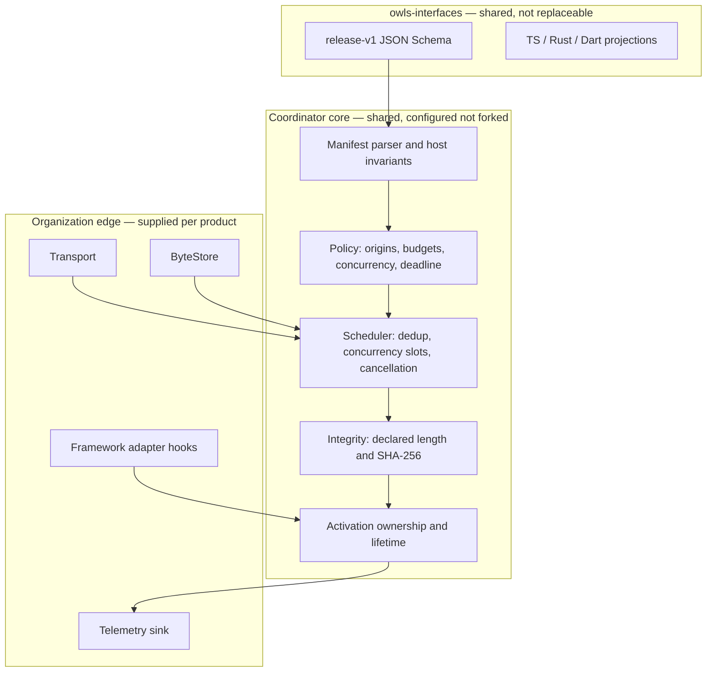

# Shared loader components

This is the component-level reference for OWLS: what each part is, which package owns it, who supplies it, how it fails, and what it costs to replace. [Architecture and runtime boundaries](architecture.md) explains why the boundaries fall where they do; this document enumerates the pieces.

The organizing rule: **one shared coordination layer, one contract, and replaceable edges.** Nothing in the shared layer knows a framework's internals, and nothing in an organization's edge code needs a fork of the shared layer.

## Component map

## The components

### 1. Release contract — `owls-interfaces`

The JSON Schema at `schemas/release.schema.json` is the runtime authority; the TypeScript, Rust and Dart shapes are projections of it, and the TypeSpec model is a peer description, not a second authority. A release names a `schemaVersion`, `appId`, immutable `release` ID, `runtime`, `entrypoint` asset ID, its `assets`, and optional `extensions`. Each asset names its exact canonical HTTPS URL, decoded byte length, SHA-256, kind, and preparation eligibility.

Unknown top-level fields are rejected. Organization-specific data belongs under `extensions`, which the hosts treat as opaque, freeze, and fold into release identity. **Not replaceable** — divergence here is what the whole design exists to prevent.

### 2. Manifest parser and host invariants — one per language

JSON Schema cannot express every invariant, so each host adds the same host layer on top: canonical-HTTPS origin allowlisting (exact origins, never suffix matches), duplicate asset ID/URL rejection, entrypoint existence, and entrypoint kind matching the declared runtime. A URL that satisfies the schema's loose pattern but no URL parser must be reported with the declared `origin` error, not the parser's native exception.

Three implementations of one semantic is the standing divergence risk in this design. It is contained by the shared corpus in [owls-e2e](https://github.com/ores-wasm-loaders-test/owls-e2e), which every host must agree on, verdict by verdict, from outside the packages. That corpus has already caught one real divergence.

### 3. Policy — shared shape, per-product values

| Field | Meaning | Default in `browserPolicy` |
|---|---|---|
| `origins` | Exact canonical asset origins | supplied |
| `maxPrepareBytes` | Ceiling on one speculative preparation | 8 MiB |
| `maxAssetBytes` | Ceiling on any single asset, demand included | 64 MiB |
| `concurrency` | Simultaneous in-flight asset fetches | 2 |
| `timeoutMs` | Preparation and activation deadline | 30 s |
| `allowPreparation` | Veto: data-saver, slow connection, device class | `saveData` and 2g check |

The policy object is frozen at construction and its limits are validated as positive safe integers. Tune the values per product and device class; do not widen `origins` to make an integration easier.

### 4. Transport — replaceable

`FetchAsset` (TypeScript), the `Transport` trait (Rust) and `AssetTransport` (Dart). The built-in HTTP transports disallow redirects, omit credentials, send `no-referrer`, and enforce the declared byte length **while streaming**, so an over-long body is abandoned rather than buffered.

Replace it to reach a private CDN, attach an authenticated policy, or route through an organization's own client. A custom transport must honor cancellation, bound its own allocations, and complete its operations. Private authenticated bundles must not enter shared public caches.

### 5. ByteStore — replaceable

`MemoryStore` is bounded and LRU-evicting, for a single host lifetime. `CacheStorageStore` is opt-in, scoped to one origin and one `owls-`-prefixed namespace, entry- and count-bounded, and does **not** register a service worker or intercept framework requests. `FileStore` (Rust, Dart) persists verified bytes across process launches in a private application cache directory; the application owns total disk quota and eviction.

A store is a cache, never a source of truth: bytes read back are re-verified, and an entry that fails verification is evicted and refetched.

### 6. Coordinator / Host — the shared core

This is the component that actually justifies sharing. It holds:

- **A release registry** keyed `appId@release`, where re-registering an ID with different content is a `release-conflict` error rather than a silent swap.
- **Deduplication** — concurrent unsignalled preparations of one release collapse into one operation; a caller that supplies its own `AbortSignal` gets its own cancellable operation instead, so one component's cancellation never severs another's.
- **A concurrency semaphore** that hands the slot directly to the next waiter, and removes an aborted waiter from the queue rather than leaking a slot.
- **Integrity** — declared length then SHA-256, on every path including cache reads.
- **Budget enforcement before any request is issued.**
- **Activation ownership** — one adapter object per release per host; a second adapter is `adapter-conflict`, and the first adapter's result, success or failure, is shared with every later caller.
- **A deadline** that rejects the caller and signals cancellation. It cannot forcibly undo a non-cooperative adapter's side effects.
- **A telemetry sink** whose exceptions are swallowed, because reporting must never break loading.

Configure it; do not fork it.

### 7. Adapters — the framework seam

| Adapter | Supplies | The application still owns |
|---|---|---|
| `RawWasmAdapter` | Verify, optional `compile()` without instantiation, instantiate with explicit imports | The import object and the module's lifecycle |
| `BindgenAdapter` | Hands verified bytes to the exact generated glue, then a start hook | The build-owned glue import and its integrity |
| `LeptosAdapter` | A pinned hydration hook over the bindgen path | SSR markup, matching build, island selection |
| `DioxusAdapter` | The launch hook seam | Router, generated split assets, renderer lifetime |
| `FlutterAdapter` | Integrity-pinned generated bootstrap, supported loader lifecycle, multi-view engine | Build config, renderer asset URLs, document ownership |
| `NativeRuntime` (Rust) | Fuel- and memory-limited Wasmi execution of raw modules | Explicit host imports |
| WebView bridge | A fixed registered-release, allowlisted-operation channel with request IDs and completion replies | Navigation policy, platform WebView, permissions |

Adapters are thin on purpose. `LeptosAdapter` and `DioxusAdapter` are deliberately little more than typed seams over `BindgenAdapter`: only a framework's own generated glue knows its imports and start function, and pretending otherwise is how a shared loader becomes a per-framework fork.

### 8. Hints and SSR helpers

`hintDescriptors` and `addHints` emit `preload` / `prefetch` / `modulepreload` descriptors derived from the same manifest, budget-checked, with `crossorigin="anonymous"` and `referrerpolicy="no-referrer"`. `linkHeader` in the DOM-free `/server` export produces the equivalent `Link:` header for an SSR response, including from a Rust server rendering with Maud.

Browser-managed hints are best effort and their traffic is not subject to the coordinator's streaming budget. Only explicit preparation enforces body limits.

### 9. Build inspection — `owls-runtime::inspect_build`

Derives sizes and hashes from real build output and emits manifest JSON. It refuses symlinks and refuses to guess entrypoints. Feed its output through the public validator and publish it with that exact build. Hand-written manifests, guessed Flutter filenames, or assets combined from different releases are the failure mode this component exists to prevent.

### 10. Test corpus and consumer suite — `owls-e2e`

Not a runtime component, but a structural one: a single JSON corpus of accept/reject cases with declared verdicts, consumed independently by all three installed packages, plus organization-shaped custom transports and stores. It is the only thing that keeps three implementations of the host layer honest, and it lives in the external test organization so it consumes published packages rather than sibling source.

## What is deliberately not a component

- **No universal runtime.** Flutter's WasmGC engine and a wasm-bindgen browser module have different memory models and initialization contracts. Wasmi is not a Flutter host and does not execute browser DOM glue.
- **No cross-framework loader.** One framework's generated glue cannot initialize another's binary; the imports will not match.
- **No global singleton.** One coordinator per document or worker, one adapter per release, no mutable state shared across tenants.
- **No automatic service worker.** Registering one is a lifecycle decision with scope and update semantics that belong to the application.
- **No implicit activation.** Nothing in the preparation path imports JavaScript, executes a bootstrap, starts WASM, hydrates an island, or mounts a view.

## Where the sharing actually lands

The realistic target is sharing the **loading and integration infrastructure**, not application code, downloaded bytes, or runtime memory.

| Layer | Shared across organizations | Supplied per product |
|---|---|---|
| Release contract and validation | All of it | The manifest values |
| Coordination, dedup, budgets, integrity, cancellation, ownership | All of it | Policy values |
| Resource hints and SSR headers | The derivation | Which surface emits them |
| Transport and storage | The interfaces and the defaults | CDN, auth policy, cache scope |
| Framework activation | The seam and lifecycle rules | The build's glue, hooks, mount targets |
| Build inspection and release publishing | The tool | The build itself |
| Conformance corpus and lifecycle tests | All of it | Product-specific fixtures |

Two independently built applications do not automatically share downloaded bytes just because they share Rust crates in source, and a Zed package shared in source is not a separately cached browser artifact. Byte-level reuse requires deliberately shared output artifacts or an explicit module boundary — measure it, do not assume it.
